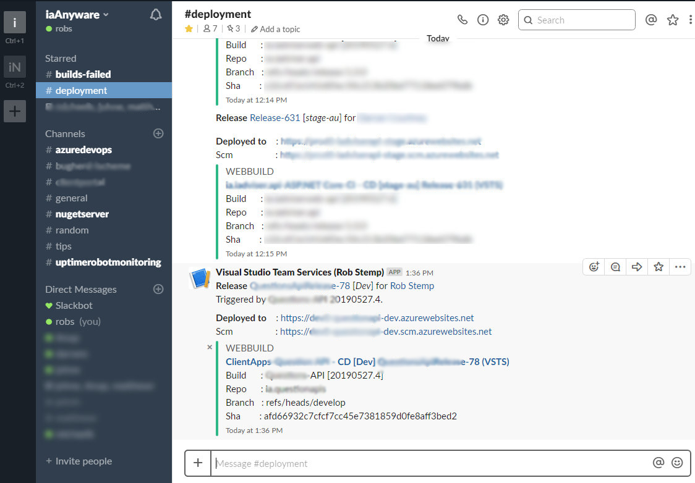

# How I setup Azure DevOps

Setting up Azure DevOps (formely known as VSTS - *Visual Studio Team Services*) for multiple projects.

In Azure DevOps, Builds and Releases are separated to follow the C.I / C.D processes, this works well with a **Build Once, Deploy Anywhere** strategy that is a principle of CI/CD.

We had the following project types:

- Legacy .NET Framework Web Services (SOAP WSDL's .NET.3.5 - 4.5)
- Legacy Windows Winform applications .NET Framework 3.5-4.x
- .NET Framework 4.x Windows Services that required Windows WIN32 Api's for drawing.
- .NET Framework 4.5 MVC projects (full MVC with views) with EF6
- .NET Core 2.x+ Web API's with static resource serving for cases such as SPA's
- .NET Core 2.x command line applications
- NodeJS based frontends in Aurelia (similar to Angular though more conventions)
- Azure WebJobs handling queues for generating long running reports, Converting to PDF, etc. Complex processes involved
- Azure Serverless functions (to note, a cloud Email queue handler, other web job type scenarios)
- Azure File(s) deployments for App Configurations  (appsettings across multiple environments to handle centralization of configuration across 7+ API's, console projects, windows services), [read more](how-to-create-shared-configuration-using-azure.md)

Visual Studio Team Services Build Agent
-------------------------------------------

When initially experimenting with VSTS (Azure DevOps), I tested the hosted build agent(s) they offered, these were ok for very simple scenarios, say a simple web api....however very limited, so went to the Build Server VM we had setup for scripted deployments (prior to VSTS) and installed the Agent, this was remarkably simple, once setup it ran as a windows service. I just had to make sure it had all the relevant folder permissions for the user it was running as.

Web Applications
-----------------------------------

The web apps were deployed to Azure App Services, Azure Plans with S1 or greater, this was critical as they provided *deployment slots* which dramatically simplified multi-environment setups. With one dev subscription with a beefy server, and one production subscription with extra beef. the Dev handled all development envrionments, while production was just staging and production itself.

#### Azure Release Stages (environments)
The release *stages* (terminiology in azure devops to define the actual deployment stage) were setup so the stage name was the deployment slots name, and dynamically retrieved from the release pipeline. This meant that creating a new stage was just duplicating an existing one, and renaming it (The default approach required duplicating a stage, than opening it up to find the azure app deploy and manually selecting it from a dropdown which introduces another point that's easy to forget)  .. after setting up the process, we could create a *new deployment environment in about 5 minutes*:

Create new deployment environment process (approx 5-10 minutes)
- create deployment slot (created command line script to handle this via the `az` command line tool)
- duplicate azure devops release slot
- rename slot.
- (optional) create an appsettings.{env}.json file in a configruation repository which is deployed upon commit, for more info on how this was achieved, check out [shared config With azure](how-to-create-shared-configuration-using-azure.md)

When creating an azure deployment slot (scripted or via GUI), there is a couple of settings that were especially important.
- Appliation configuration **ASPNETCORE_ENVIRONMENT** was set to the deployment slot's name
- The **Slot Setting** checkbox, without this, the configuration would be "leaked" from the main slot. super important.

The command line script handled creation of these, it's easy enough to do via azure portal as well.

#### Deployment notification
When web applications were deployed successfully (after deployment would make a simple request to warmup api and verify a-OK) a custom task group was created to provide a clean slack notification. This was consistent across any type of web application, .NET Framework, .NET Core, Static HTML (ie SPA). 

Of importance, when dealing with many projects, the deployed URL, and SCM is the diagnostic path, and process management for that web app were provided, along with the Azure DevOps direct link to the release page, and repository/build information. I created a custom slack channel to avoid polluting other channels.

#### Web application stack structure
Initially the web applications had the backend .NET apis combined with the nodejs frontends in a single repository (the default method when using angular template in .NET Core). However as demands and complexity grew for the frontend we hired some very skilled front-end developers.

Now all of the repositories were in bitbucket since about 2013, but we wanted to separate what the frontend developers had access to.

So I separated the backend repositories from the frontend, with command line scripts to compile front-end and copy them to the backend `wwwroot` folder (very common). Toyed with the idea of having static servers just for frontend, though this would mean having to provide the api's backend domain name for each environment, ie `apiHost` (as the api would be on a different domain)....which meant it had to be done in configuration, effectively upon the build with nodejs........which doesnt work well with a CI/CD type of setup.

The solution was to build the nodejs client app and zip it up within it's Buld pipeline, store it on an accesible share (VM, Azure File Share, didnt matter) with a naming convention representing it's branch, buildrev etc, than on the build/release pipeline of the API that would host it, it would download the zip, and extract it to the `wwwroot` folder.. This took care of the environment issue.

As to the separation of access for frontend, at first this was all done in bitbucket, though later I moved the backend repositories to Azure DevOps which was linked to the Office365 login for company workers, and we just left the frontend repositories in bitbucket. Which simplified access.

